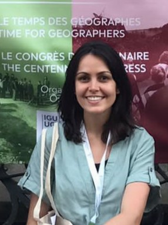

## About
Hi, my name is Mirela Barros Serafim. I'm a spatial data analyst with a PhD in Geography focused on health geography. Throughout my career, I have contributed to many projects in sustainable urban development, environmental science, socioeconomic analysis, and public health, consistently integrating vulnerable populations through field-specific approaches.

---
## Core Competencies

- GIS for sustainable development
- Geospatial data processing, spatial modeling, and cartography
- Data analysis, statistical modeling, and reproducible research workflows
- Teaching, training facilitation, and academic mentoring
- Scientific communication and international research collaboration

---

<a href="https://www.linkedin.com/in/mirela-b-21927b100" target="_blank">
<i class="fa-brands fa-linkedin"></i>
</a>

<a href="https://www.researchgate.net/profile/Mirela-Serafim" target="_blank">
<i class="ai ai-researchgate"></i>
</a>

<a href="https://orcid.org/0000-0003-4843-8485" target="_blank">
<i class="ai ai-orcid"></i>
</a>

